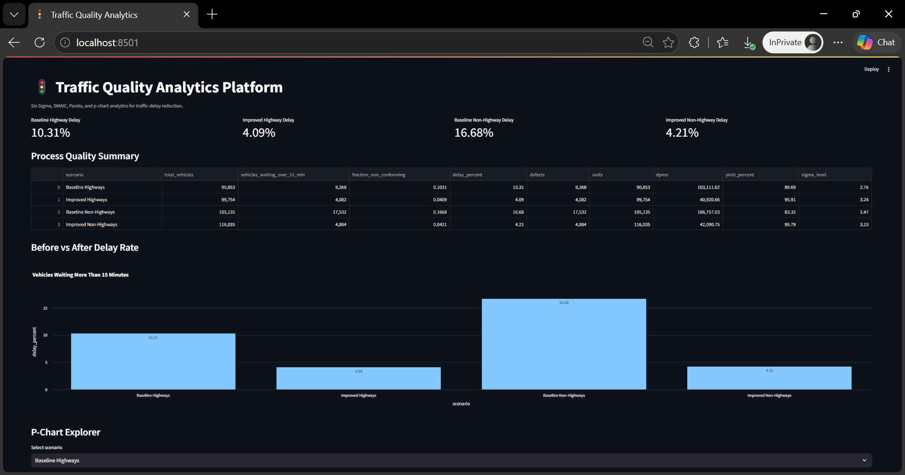
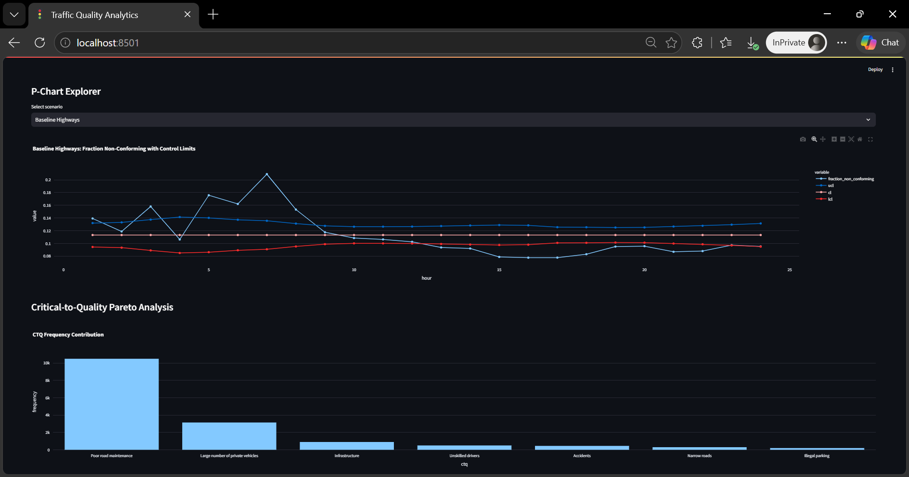
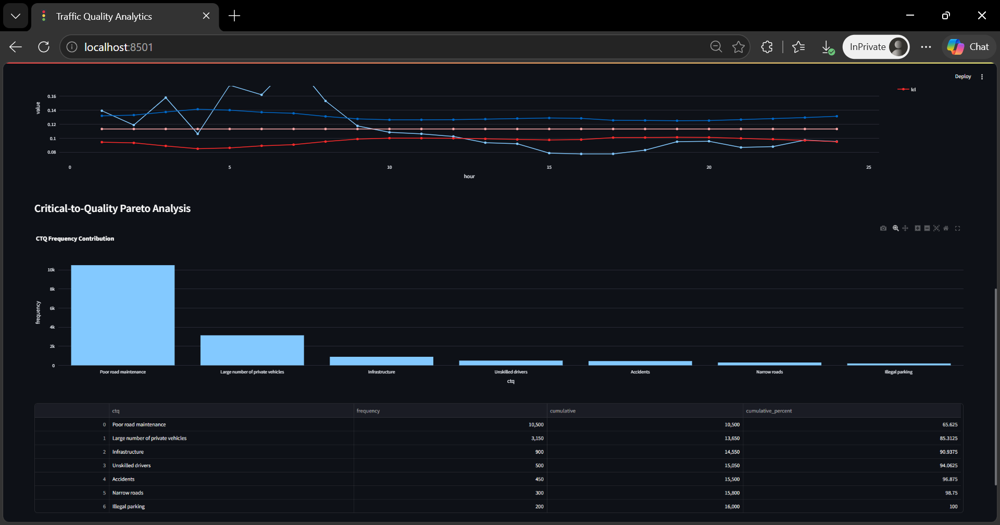
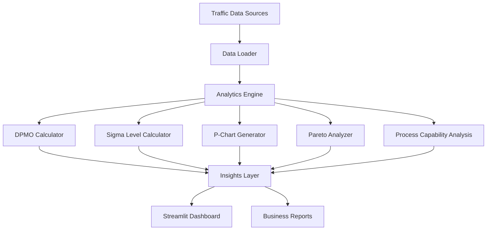

<div align="center">

# 🚦 Traffic Quality Analytics Platform

### Production-grade traffic quality analytics platform applying Six Sigma, DMAIC, Pareto Analysis, Control Charts, and Process Capability metrics to identify and reduce traffic congestion delays.

<p>
  
  
  
</p>

<p>
  
  
  
</p>

<p>
  
  
  
</p>

<p>
  <a href="#-overview">Overview</a> •
  <a href="#-features">Features</a> •
  <a href="#-screenshots">Screenshots</a> •
  <a href="#-architecture">Architecture</a> •
  <a href="#-dmaic-methodology">DMAIC</a> •
  <a href="#-quick-start">Quick Start</a> •
  <a href="#-results">Results</a>
</p>

</div>

---

# 📌 Overview

Traffic congestion impacts productivity, fuel consumption, operational efficiency, and public safety. This project transforms a Master's-level Quality Systems Engineering study into a reproducible Python analytics platform that applies Six Sigma methodologies to traffic management.

The platform analyzes highway and non-highway traffic delay data using statistical quality engineering techniques including DPMO, Sigma Level calculations, Pareto Analysis, Control Charts, Process Capability studies, and DMAIC-based improvement workflows.

The goal is to identify critical traffic bottlenecks, quantify process inefficiencies, and evaluate measurable improvements through data-driven decision making.

---

# ✨ Features

<table>
<tr>

<td width="33%" valign="top">

### 📊 Quality Analytics

* DPMO calculations
* Sigma level analysis
* Yield percentage tracking
* Defect rate measurement
* Traffic delay metrics
* Performance benchmarking

</td>

<td width="33%" valign="top">

### 📈 Statistical Analysis

* P-Charts
* Pareto Analysis
* Process Capability
* Root Cause Analysis
* CTQ prioritization
* Trend visualization

</td>

<td width="33%" valign="top">

### 🚀 Engineering

* Streamlit Dashboard
* Modular Python Architecture
* Pytest Test Suite
* Docker Support
* GitHub Actions CI
* Reproducible Analytics

</td>

</tr>
</table>

---

# 🧱 Tech Stack

<div align="center">

<table>

<tr>

<td align="center" width="25%">
<br/>
<b>Python</b><br/>
Core Analytics
</td>

<td align="center" width="25%">
<br/>
<b>Streamlit</b><br/>
Dashboard
</td>

<td align="center" width="25%">
<br/>
<b>Docker</b><br/>
Deployment
</td>

<td align="center" width="25%">
<br/>
<b>GitHub Actions</b><br/>
CI/CD
</td>

</tr>

<tr>

<td align="center">
<br/>
<b>Pandas</b><br/>
Data Processing
</td>

<td align="center">
<br/>
<b>Plotly</b><br/>
Visualization
</td>

<td align="center">
<br/>
<b>Pytest</b><br/>
Validation
</td>

<td align="center">
<br/>
<b>Quality Engineering</b><br/>
Methodology
</td>

</tr>

</table>

</div>

---

# 📸 Screenshots

<p align="center">
  
</p>

<p align="center">
  
  
</p>

---

# 🏗️ Architecture



---

## 🔄 End-to-End Workflow

```text
Traffic Data Collection
        ↓
Data Cleaning & Preparation
        ↓
DMAIC Quality Assessment
        ↓
DPMO & Sigma Calculations
        ↓
Control Chart Generation
        ↓
Pareto Analysis
        ↓
Root Cause Identification
        ↓
Improvement Recommendations
        ↓
Business Impact Evaluation
        ↓
Interactive Dashboard
```

---

# 📐 DMAIC Methodology

```text
DEFINE
Identify Traffic Congestion Problem
        ↓

MEASURE
Collect Delay and Traffic Volume Data
        ↓

ANALYZE
Identify Critical Delay Drivers
        ↓

IMPROVE
Implement Process Improvements
        ↓

CONTROL
Monitor Performance Through Control Charts
```

---

# 📊 Results

## Business Impact

| Metric                  | Baseline | Improved |
| ----------------------- | -------: | -------: |
| Highway Delay Rate      |   10.31% |    4.09% |
| Non-Highway Delay Rate  |   16.68% |    4.21% |
| Highway Sigma Level     |     2.76 |     3.24 |
| Non-Highway Sigma Level |     2.47 |     3.23 |
| Highway Yield           |   89.69% |   95.91% |
| Non-Highway Yield       |   83.32% |   95.79% |

---

## Critical-To-Quality Drivers

| Rank | Traffic Issue                    | Contribution |
| ---- | -------------------------------- | -----------: |
| 1    | Poor Road Maintenance            |       65.63% |
| 2    | Large Number of Private Vehicles |       19.69% |
| 3    | Infrastructure Limitations       |        5.63% |
| 4    | Unskilled Drivers                |        3.13% |
| 5    | Accidents                        |        2.81% |

---

<details>
<summary><strong>📁 Folder Structure</strong></summary>

```text
traffic-quality-analytics-platform/
│
├── app/
│   └── streamlit_app.py
│
├── src/
│   ├── data_loader.py
│   ├── six_sigma.py
│   ├── control_charts.py
│   ├── pareto.py
│   ├── capability.py
│   └── report_generator.py
│
├── tests/
│   ├── test_six_sigma.py
│   ├── test_control_charts.py
│   └── test_capability.py
│
├── data/
│   ├── raw/
│   └── processed/
│
├── docs/
│   ├── project_report.pdf
│   └── screenshots/
│
├── Dockerfile
├── requirements.txt
├── LICENSE
└── README.md
```

</details>

---

# ⚡ Quick Start

## Clone Repository

```bash
git clone https://github.com/TaranjyotS/traffic-quality-analytics-platform.git
cd traffic-quality-analytics-platform
```

## Install Dependencies

```bash
pip install -r requirements.txt
```

## Run Dashboard

```bash
streamlit run app/streamlit_app.py
```

Open:

```text
http://localhost:8501
```

---

## Run Tests

```bash
pytest -v
```

---

## Run With Docker

```bash
docker build -t traffic-quality .
docker run -p 8501:8501 traffic-quality
```

---

# 🧪 What This Project Demonstrates

| Skill Area                  | Demonstrated Through                |
| --------------------------- | ----------------------------------- |
| Data Analytics              | Traffic delay analysis using Pandas |
| Statistical Engineering     | Sigma, DPMO, Yield, Capability      |
| Quality Systems Engineering | DMAIC and Six Sigma                 |
| Data Visualization          | Plotly dashboards                   |
| Software Engineering        | Modular Python architecture         |
| Testing                     | Pytest validation suite             |
| DevOps                      | Docker and CI/CD pipelines          |
| Business Analytics          | Quantified improvement tracking     |

---

# 🗺️ Roadmap

| Priority | Improvement                            |
| -------- | -------------------------------------- |
| High     | Real-time traffic data integration     |
| High     | FastAPI backend APIs                   |
| Medium   | Historical trend forecasting           |
| Medium   | Machine learning congestion prediction |
| Medium   | Geospatial traffic mapping             |
| Low      | Kubernetes deployment                  |
| Low      | Cloud deployment templates             |
| Low      | Multi-city benchmarking dashboards     |

---

# 📄 License

This project is licensed under the [MIT License](LICENSE).

---

# 🎓 Academic Foundation

This project originates from research conducted during the ****Master of Engineering (Quality Systems Engineering)** program at **Concordia University** and has been modernized into a portfolio-grade analytics platform while preserving the original Six Sigma and traffic quality improvement objectives.

---

# ⚠️ Disclaimer

The datasets used in this project are intended for educational, analytical, and research purposes. Results are provided to demonstrate quality engineering methodologies and should not be interpreted as real-time traffic management recommendations.
